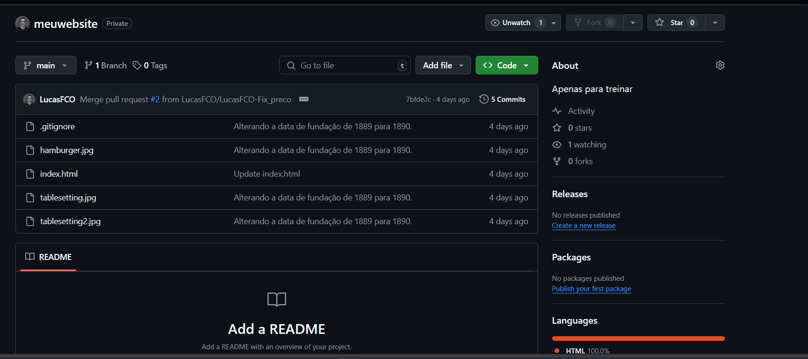
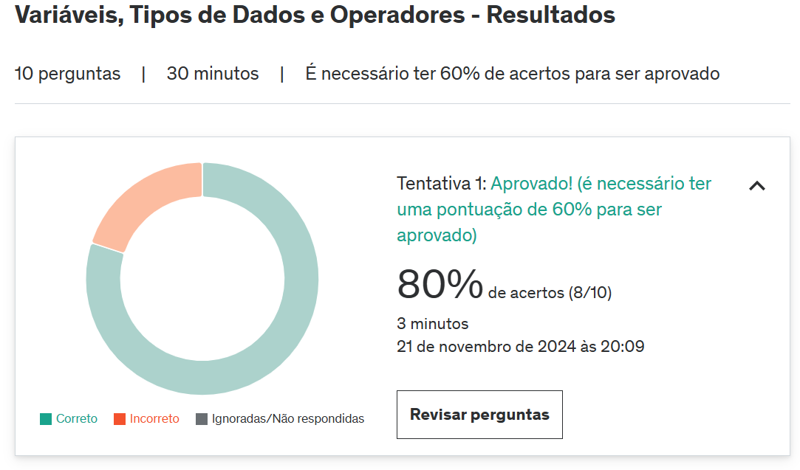
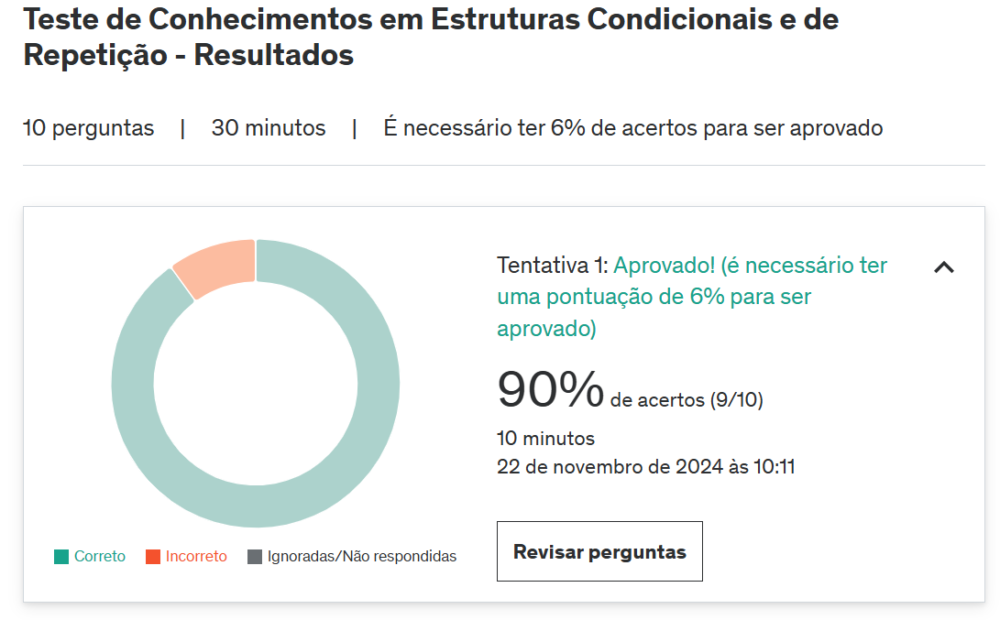

<!--
# Exercícios

1. ...
[Resposta Ex1.](exercicios/ex1.txt)
-->

# Evidências

<!--Ao executar o código do exercício ... observei que ... conforme podemos ver na imagem a seguir: -->
Segue como evidencia um print do GitHub com os commits feitos após o terminio do curso de Git e GitHub.

No fim de algumas seções do curso de Python, houve alguns simulados com questoes teoricas sobre o conteudo aprendido, segue evidencia da conclusão e aprovação. .

# Certificados

- Certificado do Curso Data & Ai - Ciência de Dados - Introdução

- Certificado do Curso de Git e GitHub

