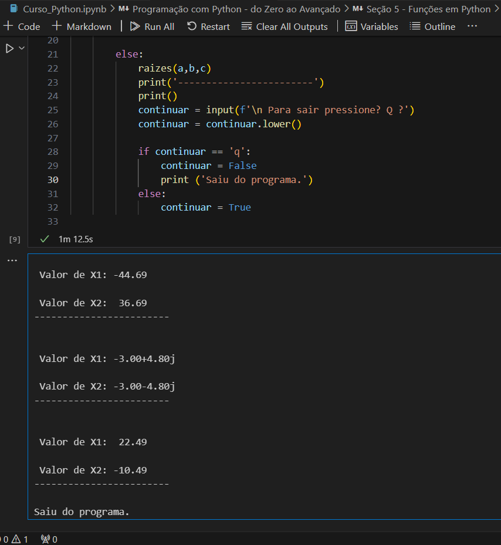

# Exercícios

1. O arquivo Curso_Python contém a implementação de alguns códigos apresentados pelo professor, bem como exercícios propostos por ele. 
[Curso_Python](exercicios/Curso_Python.ipynb)

2. O arquivo Curso_Pandas_Exercícios reúne um compilado de exercícios propostos pelo instrutor ao longo dos três módulos do curso.
[Curso_Pandas_Exercicios](exercicios/Curso_Pandas_Exercicios.ipynb)

# Evidências

<!--Ao executar o código do exercício ... observei que ... conforme podemos ver na imagem a seguir: -->

1. Como evidência do curso de Git e GitHub, segue um print do GitHub mostrando os commits realizados após a conclusão do curso.

Como evidência da conclusão dos exercícios do arquivo Curso_Pandas_Exercícios, seguem  alguns prints da execução dos códigos correspondentes.

2. Script para mudar a escala do atributo User_core. 

3. Script para apagar algums atributos do dataframe. 

4. Script para filtrar um itens de uma categoria especifica do dataframe. 

5. Script para filtrar os jogos de maior score de uma categoria especifica. 

Para comprovar o acompanhamento do curso de Python, seguem alguns prints da execução de códigos apresentados durante as aulas. 

6. Script para verificar se um aluno foi aprovado conforme a média das notas e o numero de faltas.

7. Script para calcular as raízes de uma equação do segundo grau usando a fórmula de Bhaskara.

8. Script testar a diferença entre variaveis globais e locais.

# Certificados

- Certificado do Curso Data & Ai - Ciência de Dados - Introdução

- Certificado do Curso de Git e GitHub

- Certificado do Curso de Pandas

