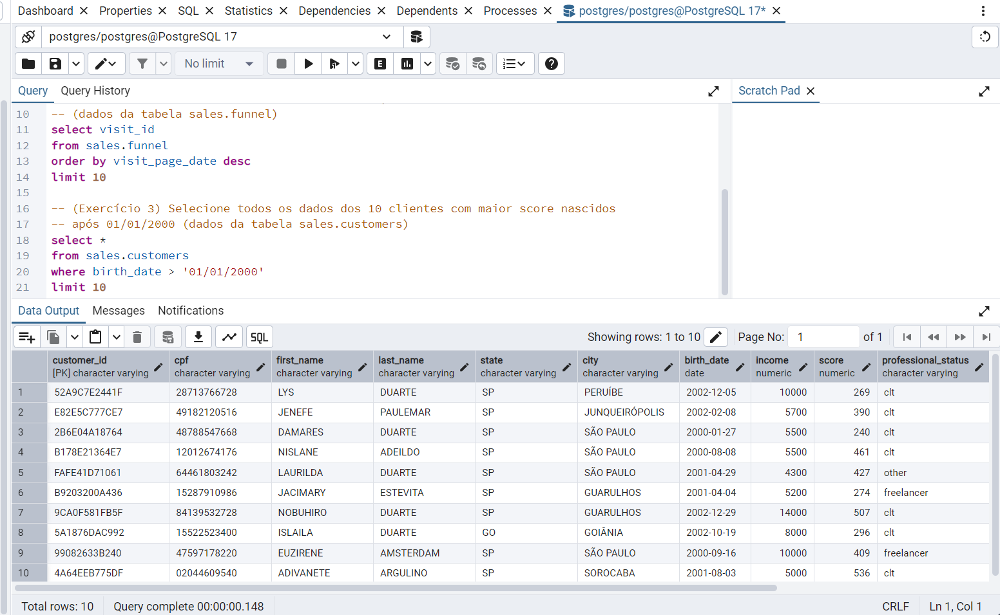

<!-- 
Utilize o arquivo README.md da Sprint para organizar todas as suas entregas. Faça referência aos arquivos de código-fonte. Evite colocar código diretamente no Markdown pois dificulta nossa avaliação.
-->
# Exercícios

1. Como o professor não propôs exercícios ao longo do curso, os exemplos apresentados durante os módulos foram implementados. Alguns dos exemplo está acompanhado de informações sobre seu propósito ou e contexto.
[Curso de estatistica - Exemplos.](exercicios/curso_estatistica.ipynb)

2. Segue um compilado de exercícios propostos pelo instrutor durante o curso de SQL.
[Curso de SQL - Exercicios.](exercicios/exercicios.sq)
# Evidências

1. Teste de nomarlidade executado durante o curso de estistica. Um dos testes aplicados foi o de Shapiro-Wilk.

2. Outro teste ensinado pelo intrutor do curso, foi o de regressão. O segue o print da tela com a replicação do teste. 

3. Durante o curso tabém foi ensinado um metodo de analise mais visual. Abaixo como evidecia foi selecionado o Heatmap para analise de correlação. 

4. Como primeira evidencia, segue a criação das tabelas utilizadas durante o curso de banco de dados.

5. Execução do exercicio proposto pelo instrutor.

6. Execução do exercicio proposto pelo instrutor.

# Certificados

- Estatística para Análise de Dados com Python.

- Curso de Sql para analise de dados.

