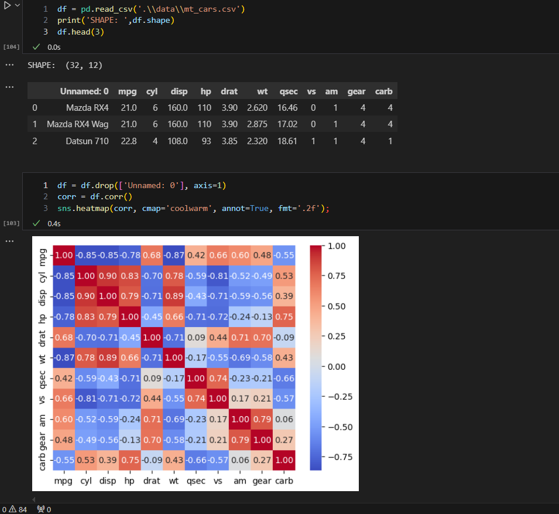
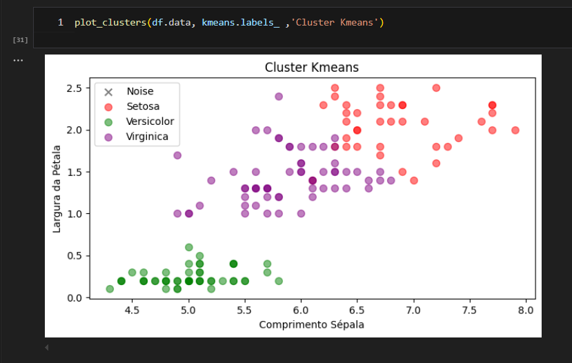
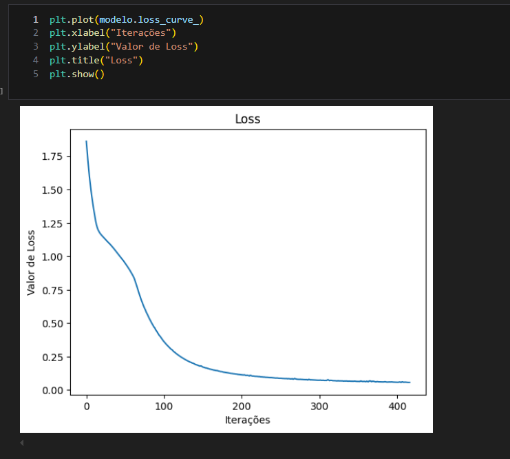
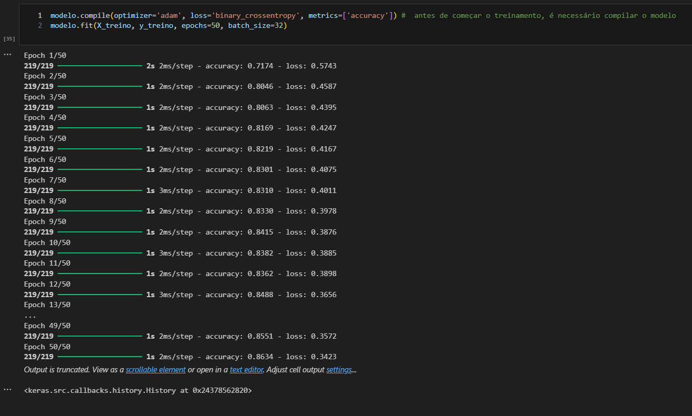
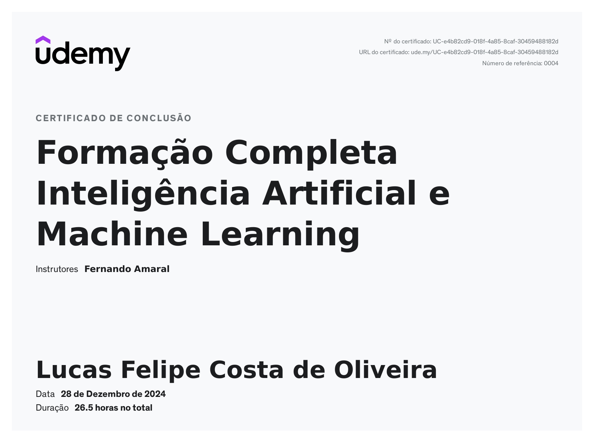

# Exercícios

1. Como o instrutor não propôs exercícios, os códigos apresentados neste notebook consistem em um compilado de exemplos fornecidos por ele, abrangendo todas as seções. Todos os datasets utilizados, assim como os scripts que ele usou como módulo, estão na pasta data.zip.
[Exemplos/Execicios](exercicios/exercicios_ia_ml.ipynb)

# Evidências

- A primeira evidência é uma matriz de correlação apresentada como um mapa de calor, destacando os valores das correlações entre os atributos em cada célula.

- A segunda imagem ilustra a distribuição dos clusters após o treinamento do modelo K-means no conjunto de dados Iris dataset

- Esta captura de tela mostra a diminuição do valor de loss conforme aumenta o número de iterações no treinamento de um modelo MLP, apresentada em formato gráfico.

- A última imagem exibe o código referente à instanciação e treinamento de um modelo MLP executado por 50 épocas. A representação acompanha o aumento da acurácia e a diminuição da perda ao longo do treinamento.

# Certificados

- Certificado do curso Formação Completa Inteligência Artificial e Machine Learning.

