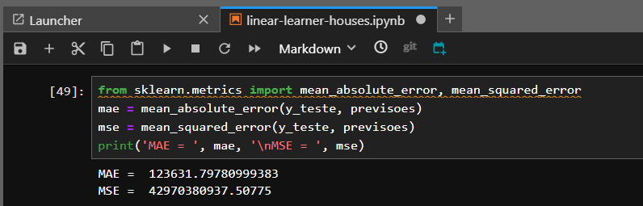

# Exercícios

1. Como o instrutor não propôs exercícios, os códigos apresentados neste notebook consistem em um compilado com boa parte dos exemplos fornecidos por ele. Todos os datasets utilizados estão na pasta data.zip.
[Exemplos/Execicios](exercicios/Exercicios_(compilado).ipynb)

2. Esta seção contem alguns explos passados pelo instrutor durante o curso do AWS SageMaker.
     - [Exemplo envio de arquivos](exercicios/exemplos_sagemaker/integração-s3/enviar-arq.ipynb)

     - [Exemplo download de arquivos](exercicios/exemplos_sagemaker/integração-s3/dowload-arq.ipynb)

     - [Exemplo de scrip para algoritmo linear learner](exercicios/exemplos_sagemaker/regressao/linear-learner-houses.ipynb)

     - [Exemplo de scrip para algoritmo Xgboost](exercicios/exemplos_sagemaker/regressao/xgboost_houses.ipynb)
    
     - [Exemplo de scrip para algoritmo de agrupamento](exercicios/exemplos_sagemaker/pca-agrupamento/pca-agrupamento-credit-card.ipynb)

# Evidências
1. O GitHub não suporta a exibição de gráficos interativos gerados pela biblioteca Plotly diretamente no repositório. Para contornar essa limitação, a função abaixo converte os gráficos em imagens estáticas. Essas imagens são geradas a partir dos gráficos criados com o Plotly e podem ser salvas e incorporadas ao repositório, permitindo que os resultados sejam visualizados de forma clara, mesmo sem suporte interativo.

2. Este print mostra a execução da função responsável por gerar e exibir as imagens estáticas dos gráficos, permitindo sua visualização mesmo em plataformas que não suportam gráficos interativos, como o GitHub. .

3. A primeira imagem apresenta o script responsável pela criação do bucket. Este bucket será utilizado para armazenar os arquivos necessários à execução dos modelos criados, bem como os modelos resultantes após o treinamento.

*Nota: Buckets são áreas de armazenamento na nuvem que permitem a organização em diversos diretórios, facilitando a gestão dos dados.*

4. Na etapa final, temos o processo de Deploy, onde são realizadas as previsões e a avaliação do modelo. Após realizar a atividade de predição, podemos interpretar os resultados obtidos. Observamos que o modelo apresenta um erro médio de ±123.631,80 dólares, conforme indicado pelo MAE (Mean Absolute Error).

Embora funcional, essa performance não é ideal. Com a utilização de outro algoritmo ou ajustes no modelo, é possível obter previsões mais próximas dos valores reais.

5. Esta imagem evidencia a utilização da função de Tuning do SageMaker. Nela, podemos observar diversos modelos criados e a seleção dos melhores hiperparâmetros. Ao analisar o código, é possível verificar que a configuração do modelo segue exatamente a escolhida pelo algoritmo durante o processo de otimização.

6. Este print demonstra que todos os endpoints criados, juntamente com suas respectivas configurações, foram deletados. Essa é uma prática recomendada para evitar custos desnecessários na utilização do SageMaker, garantindo uma gestão mais eficiente dos recursos.

7. Este é um print da área de gestão de custos da plataforma AWS. Essa ferramenta permite monitorar detalhadamente os gastos com os serviços utilizados, como SageMaker, S3 e outros.
Na interface, é possível visualizar os custos acumulados em diferentes períodos, identificar quais serviços estão consumindo mais recursos e configurar alertas orçamentários para evitar surpresas. Além disso, ela oferece relatórios personalizados, que ajudam a entender o padrão de uso e a planejar estratégias de otimização para reduzir custos desnecessários.
Essa funcionalidade é essencial para gerenciar e controlar os gastos de maneira eficiente, especialmente em projetos que utilizam serviços escaláveis da AWS.

# Projeto

 - [Link para o video do projeto da sprint 4](https://compasso-my.sharepoint.com/personal/lucas_felipe_pb_compasso_com_br/_layouts/15/stream.aspx?id=%2Fpersonal%2Flucas%5Ffelipe%5Fpb%5Fcompasso%5Fcom%5Fbr%2FDocuments%2FLucas%2EOliveira%2DSprint04%2Emp4&referrer=StreamWebApp%2EWeb&referrerScenario=AddressBarCopied%2Eview%2Ee5811630%2Da2b2%2D45c1%2Dba73%2D2570e5978e22&isDarkMode=false)

# Certificados

- Certificado do curso de Machine Learning com Amazon AWS e SageMaker

Neste curso, aprendi a utilizar os recursos da AWS, incluindo o SageMaker e o S3, para criar modelos de aprendizado de máquina voltados à solução de problemas de regressão e classificação. Foram empregados algoritmos como Linear Learner e XGBoost, além de técnicas como a detecção de outliers com o algoritmo Random Cut Forest e a redução de dimensionalidade de bases de dados com o PCA (Principal Component Analysis).

As etapas para a resolução dos problemas seguiram uma estrutura clara:

1. Carregamento e análise exploratória dos dados.
2. Pré-processamento das informações.
3. Configuração do SageMaker.
4. Treinamento dos modelos.
5. Deploy, previsões e avaliação final.

Esse fluxo proporcionou uma visão prática e estruturada do uso de ferramentas da AWS para implementar e avaliar modelos de aprendizado de máquina.

 <!---->
