# Exercícios

1. O notebook exercicios_01 é referente ao curso de NLP e contém um compilado de exemplos fornecidos pelo instrutor e executados durante as aulas, incluindo algumas customizações feitas durante os testes. A maior parte dos exemplos está presente no material. Além disso, todos os datasets utilizados estão disponíveis na pasta data.zip.
[Compilado Ex1.](exercicios/exercicio_1.ipynb)

2. O notebook exercicios_02 é referente ao curso de Reconhecimento Facial e contém um compilado de exemplos organizados em seções, abordando diferentes ferramentas, como OpenCV e Flask, para a construção de um pequeno projeto ao final do curso.
Durante as aulas, foi desenvolvida uma pequena aplicação web de reconhecimento facial, que **não** está incluída no compilado de exemplos. A maior parte dos exemplos fornecidos pelo instrutor está presente no material, incluindo algumas customizações feitas durante os testes. ***IMPORTANTE*** *Uma observação importante é que, para este notebook, a pasta "data" não será disponibilizada, pois contém vários conjuntos de imagens e alguns vídeos, cujo tamanho ultrapassa o limite permitido pelo GitHub. Portanto, os arquivos de dados não serão incluídos no repositório.*
[Compilado Ex2.](exercicios/exercicio_2.ipynb)

3. Este notebook contem um compilado de exercicos  
[Compilado Ex3.](exercicios/exercicio_3.ipynb)
Este notebook contém um compilado de exemplos fornecidos pelo instrutor durante o curso de MLOps, executados e testados ao longo das aulas. Algumas customizações foram feitas para evitar erros e bugs durante a execução.
O último exemplo, referente ao deploy do modelo, foi comentado devido a incompatibilidade de versão.
Além disso, o dataset utilizado nos testes está disponível no arquivo data.zip.

# Evidências

 - A primeira evidência apresenta uma amostra de 10 palavras extraídas de um pequeno texto, servindo como exemplo de tokenização. Tokenização é o processo de dividir um texto em unidades menores chamadas tokens, que podem ser palavras, frases ou até caracteres. Para essa tarefa, foi utilizada a biblioteca SpaCy.
    - 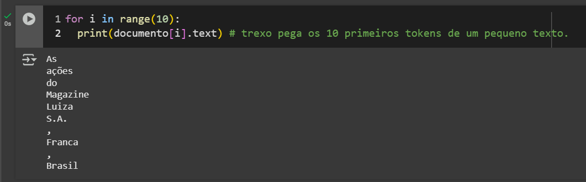

- A segunda imagem apresenta a tokenização aplicada a palavras, sentenças e stopwords, utilizando a biblioteca NLTK.
**Stopwords** são palavras comuns em um idioma, como "o", "de", "para" e "mas", que geralmente são filtradas em tarefas de Processamento de Linguagem Natural (NLP) por não carregarem muito significado. Removê-las ajuda a reduzir o ruído nos dados e a melhorar a eficiência de modelos e análises de texto.
    - 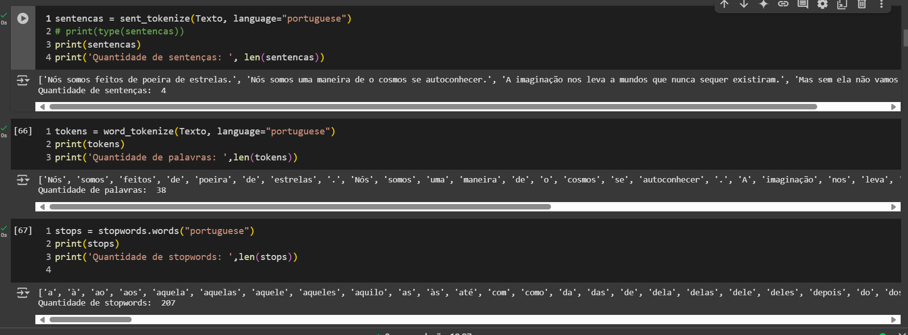

- A terceira evidência apresenta um trecho de código onde é criado um pipeline para a tarefa de Perguntas e Respostas. Esse pipeline utiliza um modelo baseado no BERT, treinado no conjunto de dados SQuAD v1.1, para responder perguntas em português de forma eficiente e contextualizada.
Após a criação do pipeline, ele foi testado com um exemplo próprio, utilizando um texto biográfico sobre a carreira do ex-atleta e atual treinador de futebol Niko Kovač. Sobre esse texto, foram feitas perguntas, e observou-se tanto as respostas geradas pelo modelo quanto os scores de confiança atribuídos a cada uma delas.
    - 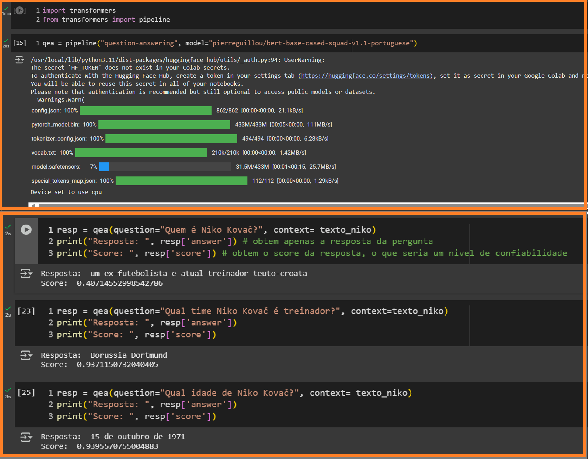

- A evidência 4 exibe a visualização de uma mesma imagem processada em três diferentes formatos de canais de cores: BGR, RGB e Pillow RGB.
O OpenCV é uma biblioteca de visão computacional que oferece diversas ferramentas para manipulação de imagens, detecção de objetos e reconhecimento facial, entre outras aplicações.
    - BGR (Blue, Green, Red): Formato padrão do OpenCV, onde os canais de cor são armazenados na ordem azul-verde-vermelho.
    - RGB (Red, Green, Blue): Formato mais comum em bibliotecas de imagem, como Matplotlib, onde os canais seguem a ordem vermelho-verde-azul.
    - Pillow RGB: A biblioteca Pillow também utiliza RGB, mas pode lidar de forma diferente com transparência e conversões entre formatos de imagem.
    - 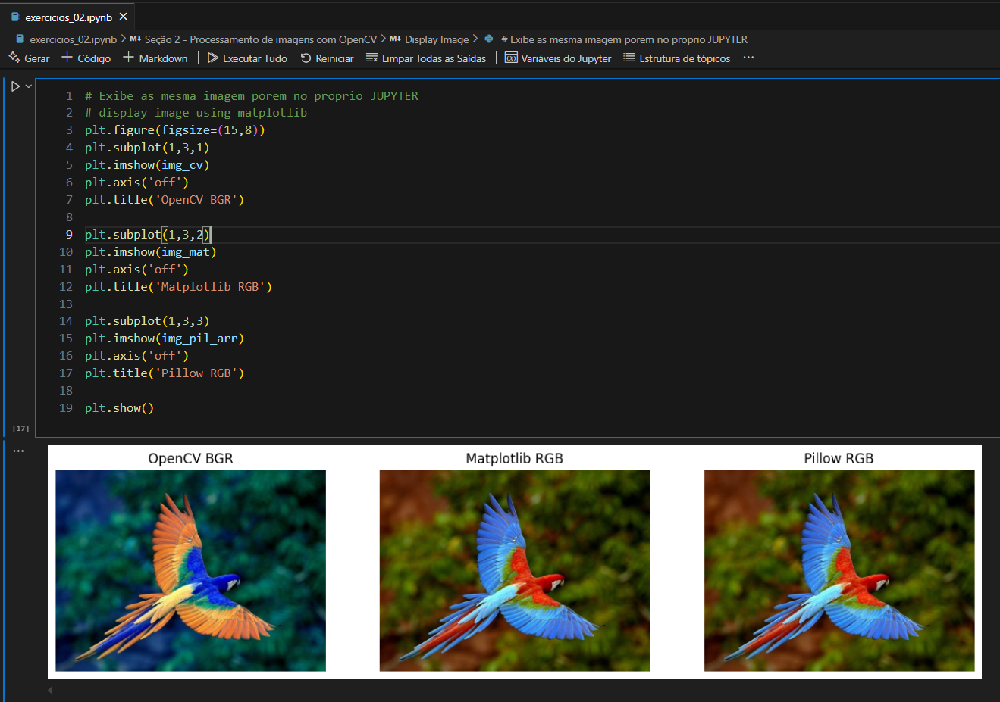

- A evidência 5 trata da criação de um pipeline usando o OpenCV, com o objetivo de realizar reconhecimento facial e classificação de gêneros.
A imagem à direita mostra o resultado desse pipeline, onde é possível visualizar a extração das principais características de cada rosto detectado, o gênero atribuído e o score da classificação. Esse processo utiliza técnicas de visão computacional para identificar e classificar as faces em tempo real.
    - 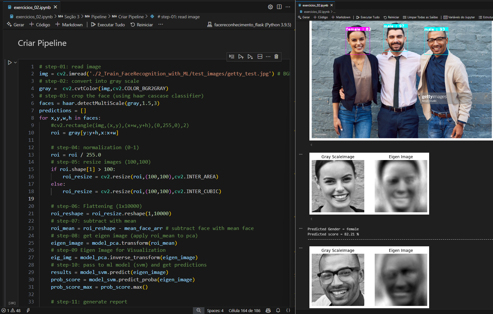

- A evidência 6 refere-se a um módulo do curso de reconhecimento facial, onde o instrutor ensinou a utilização da biblioteca Flask. Esse módulo serviu como preparação para a construção de um projeto final no curso, permitindo a integração do reconhecimento facial em uma aplicação web.
    - 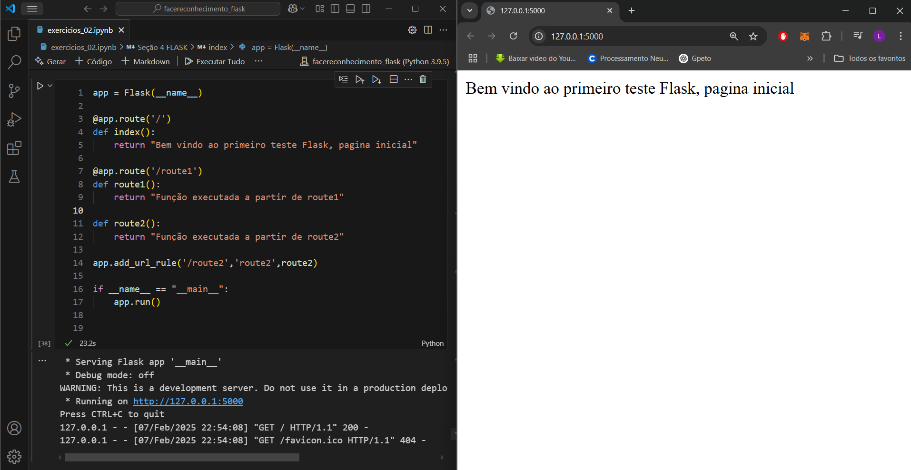

- O sétimo print mostra a função treina_rf, que treina um modelo de Random Forest com o parâmetro n_estimators, fornecido pelo usuário, e registra as informações do experimento utilizando o MLflow.
A função realiza o seguinte processo:

    - Treina o modelo com os dados de treinamento.
    - Faz previsões com os dados de teste.
    - Calcula métricas como acurácia, recall, precisão, F1, AUC e log loss.
    - Gera gráficos de matriz de confusão e curva ROC, os salva como imagens e registra tanto os gráficos quanto o modelo treinado no MLflow.
    - Exibe o identificador único da execução e finaliza o experimento.
    - 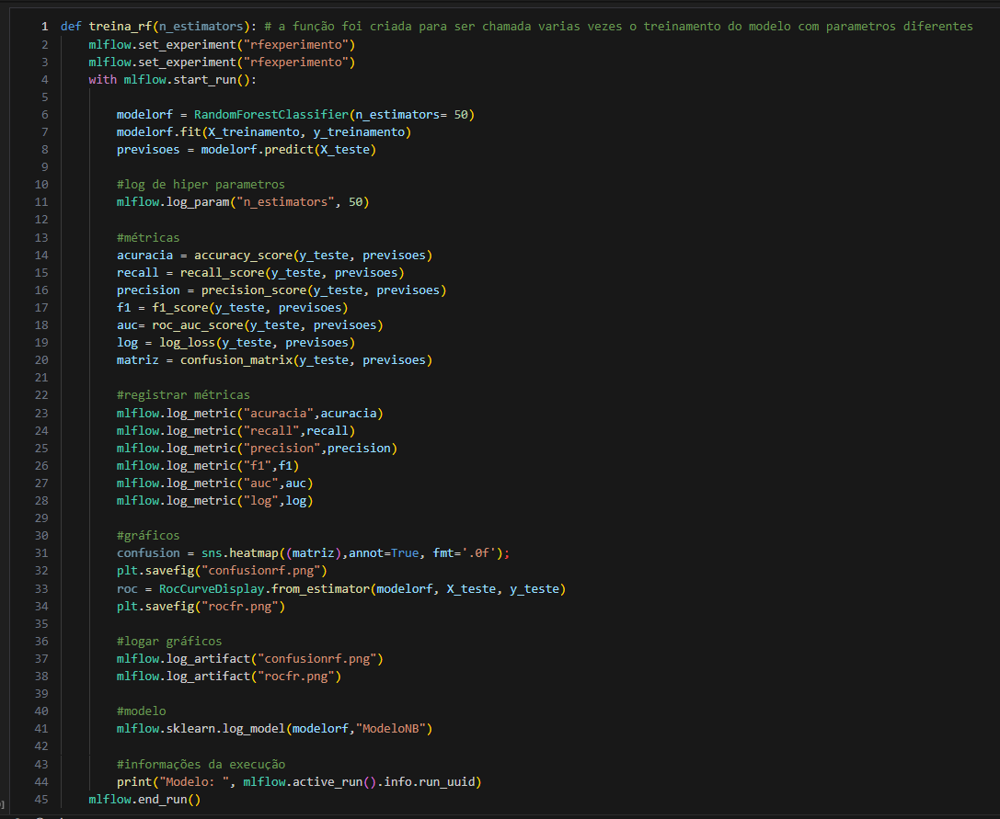

- Por fim, a evidência 8 apresenta a imagem do console do MLflow, onde é possível visualizar os experimentos criados, os testes realizados, as informações dos modelos e as métricas de avaliação. Essa interface permite monitorar o progresso dos experimentos, comparar diferentes execuções e acessar detalhes sobre os modelos treinados, facilitando a análise e a gestão dos resultados.

    - 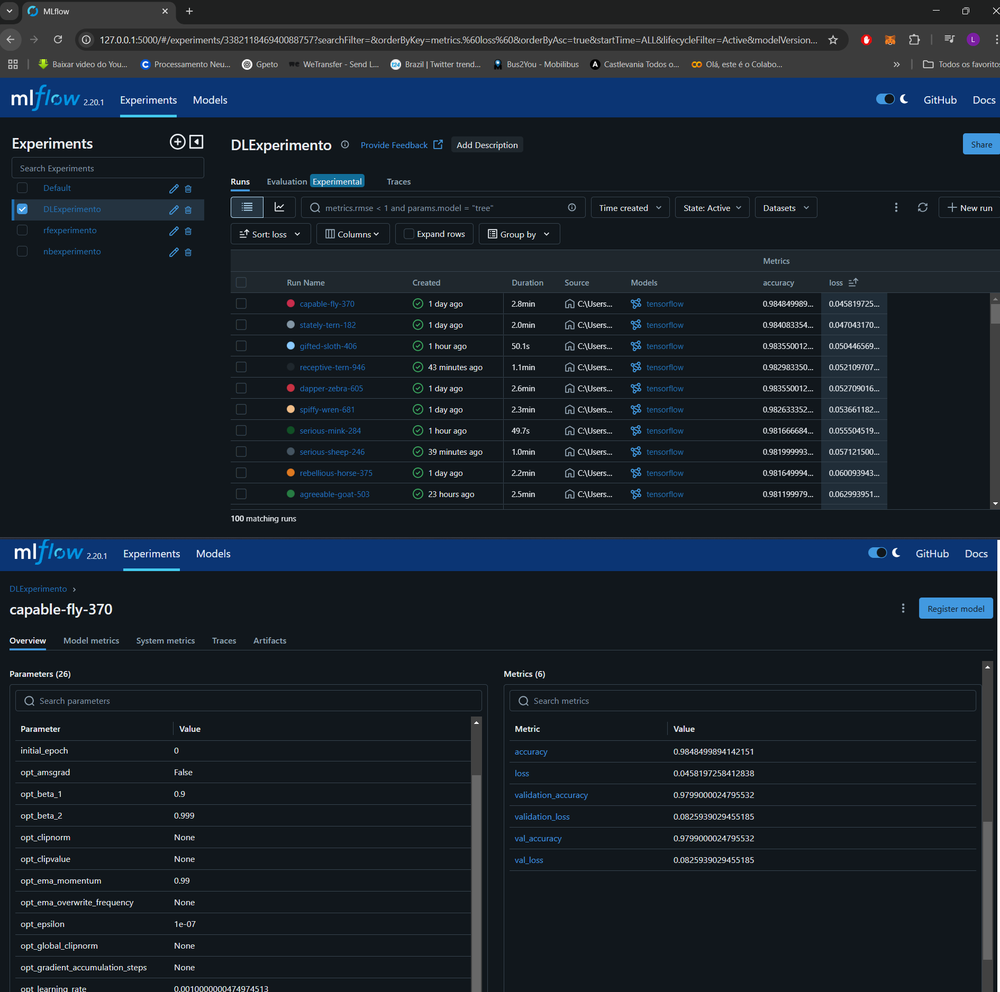

# Certificados

- Certificado do Processamento de Linguagem Natural
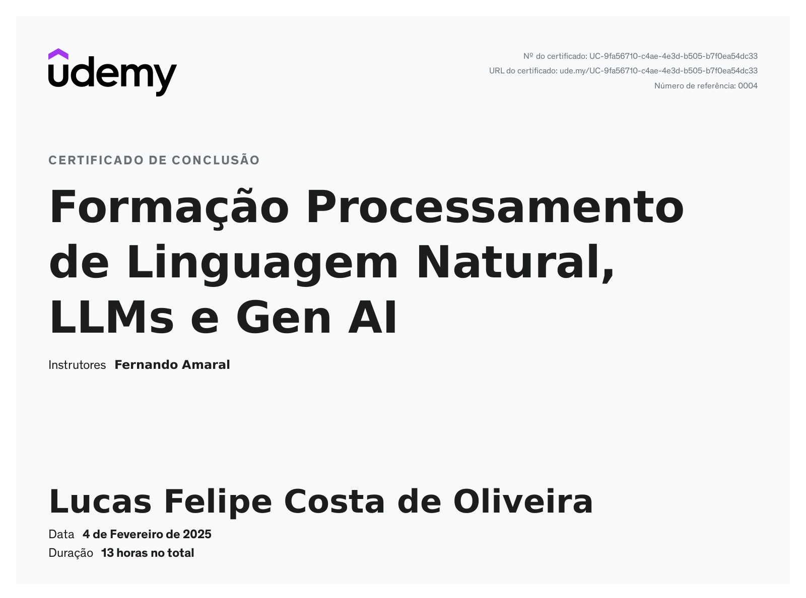

O curso de Processamento de Linguagem Natural (NLP) abrange desde técnicas clássicas até conceitos modernos, como Transformers e BERT. Ele apresenta fundamentos da área e explora diversas bibliotecas, incluindo Spacy, NLTK, TensorFlow,e Hugging Face. São estudadas e aplicadas técnicas como análise de sentimentos, respostas a perguntas, produção de resumos, tradução, preenchimento de lacunas, classificação de documentos e busca de similaridade. Além disso, o curso inclui introdução a Machine Learning e Deep Learning, modelagem de tópicos e NLP. Todo o curso foi utilizado o abiente do Google Collab.

- Certificado Curso de Reconhecimento facial
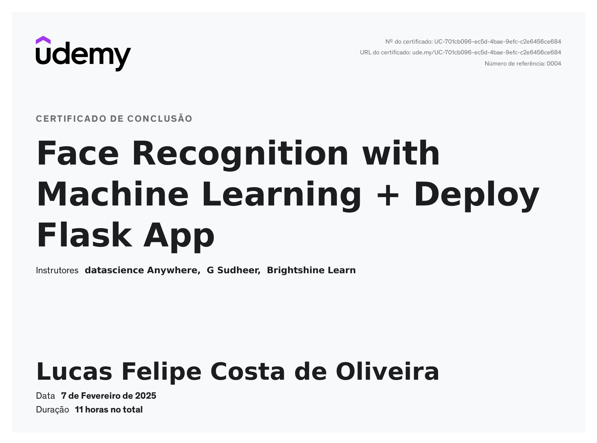

Este curso aborda técnicas de processamento de imagem utilizando OpenCV, explorando conceitos fundamentais e etapas de pré-processamento essenciais para análise de imagens. Durante o curso, extraímos características das imagens por meio da computação de imagens Eigen com Análise de Componentes Principais (PCA). Com essas imagens, treinamos um modelo de aprendizado de máquina e aplicamos o método de pesquisa Grid para otimização de hiperparâmetros.

Além do treinamento do modelo, foi ensinado a testar e validar sua eficiência antes da implantação. Posteriormente, foi desenvolvida uma interface web com Flask, utilizando HTML, CSS e Bootstrap no front-end, enquanto o back-end foi implementado em Python. Como aplicação prática, o curso culminou na criação de um sistema de reconhecimento facial, integrando o modelo de aprendizado de máquina ao aplicativo Flask.

- Certificado do Curso de MLOps
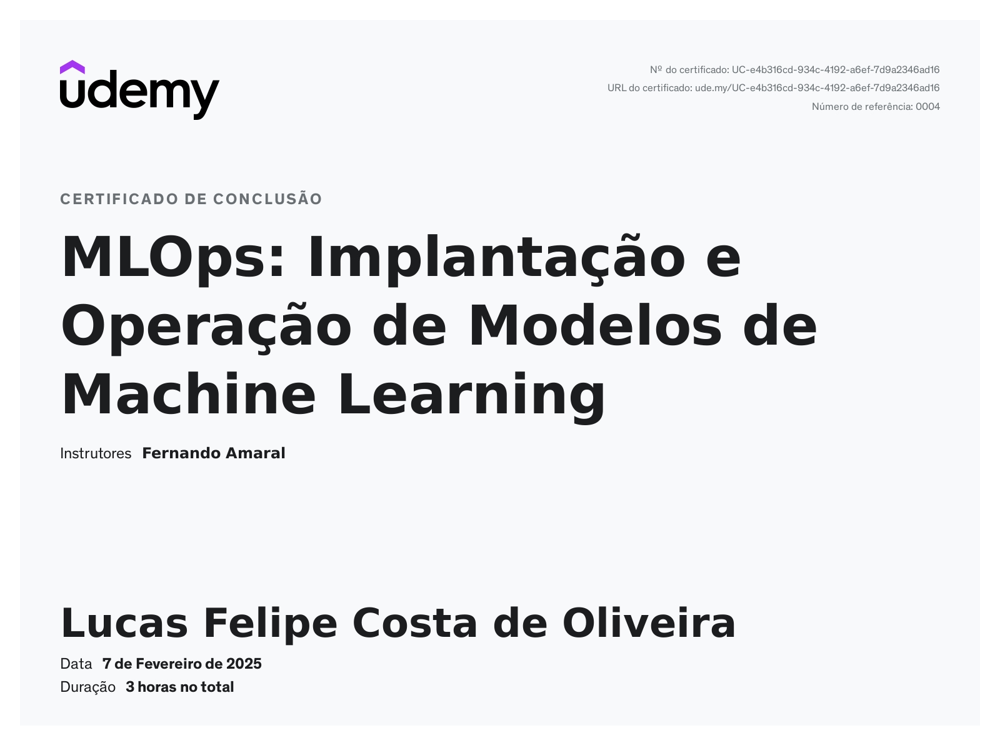

Este curso apresenta os fundamentos do MLOps, uma abordagem que integra e automatiza o desenvolvimento e a operação de modelos de Machine Learning. Exploramos desafios como versionamento, monitoramento, testes e implantação de modelos, garantindo sua eficiência ao longo do tempo. Utilizando o MLflow, aprendemos a gerenciar experimentos, armazenar métricas, organizar modelos e publicá-los como serviços web. O curso é prático e inclui scripts para aplicação direta dos conceitos aprendidos.

