# Exercícios

1. Como o instrutor não propôs exercícios, os códigos apresentados neste notebook são um compilado da maior parte dos exemplos fornecidos por ele. Alguns desses exercícios foram executados na plataforma Lambda da AWS e no VS Code local, utilizando arquivos no formato .py. Por esse motivo, as células não apresentam execução ou informações nas saídas.
[Compilado Ex1.](Compilado/ex1.ipynb)

2. Como o instrutor não propôs exercícios, os códigos apresentados neste notebook consistem em um compilado com boa parte dos exemplos fornecidos por ele. Os datasets utilizados nesta seção não serão disponibilizados no diretorio pois o tamanho supera o permitido pelo Github.
[Compilado Ex2.](exercicios/exercicio2_part1.ipynb)
[Compilado Ex2.](exercicios/exercicio2_part2.ipynb)
[Compilado Ex2.](exercicios/exercicio2_part3.ipynb)

# Evidências
1. Este print demonstra a criação de uma imagem através de um prompt fornecido. À esquerda, pode-se observar o prompt enviado na requisição (Request) e a resposta recebida no corpo da resposta (Response body), que contém um link para o download da imagem gerada. Para a criação da imagem, foi feita uma chamada de API do modelo Titan V2 da Amazon. À direita, é exibida a imagem gerada. No prompt, foi solicitado a geração da imagem de Tiamat, personagem de Dungeons & Dragons.
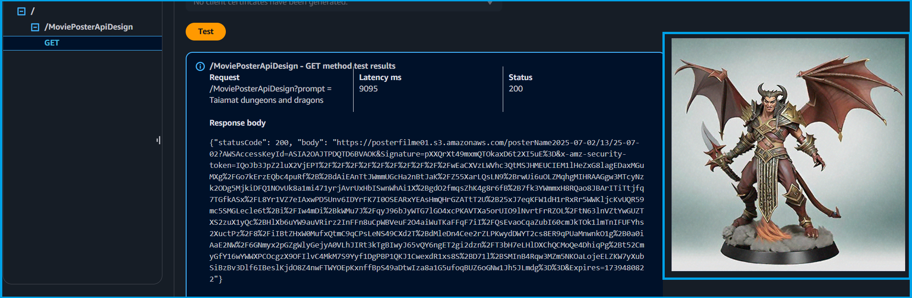

2. Este print refere-se a um script de criação de um chatbot. Os recursos utilizados foram o Streamlit para o frontend e o LangChain para o backend.
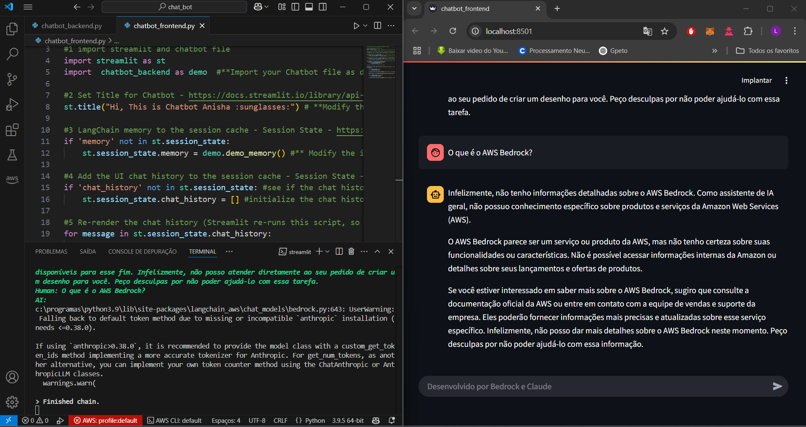

3. Esta imagem mostra a utilização do ambiente Lambda da AWS durante um exercício de vetorização e tokenização. À direita, é exibido o acompanhamento do resultado da solicitação..
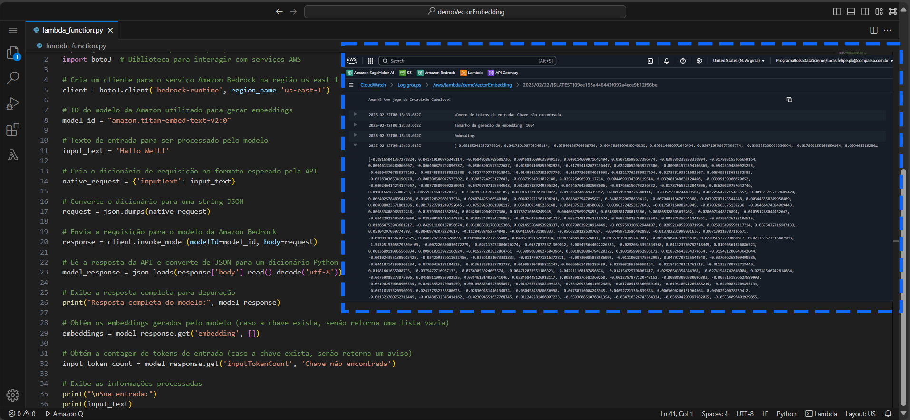

5. A ferramenta de gestão de custos da AWS permite monitorar detalhadamente os gastos com serviços como Lambda, S3 e Bedrock. A interface oferece visualização dos custos acumulados em diferentes períodos, identificação dos serviços que mais consomem recursos e configuração de alertas orçamentários para evitar surpresas. Também é possível gerar relatórios personalizados para entender padrões de uso e planejar estratégias de otimização, visando reduzir custos desnecessários. Esta funcionalidade é essencial para o gerenciamento eficiente de gastos em projetos que utilizam serviços escaláveis da AWS.
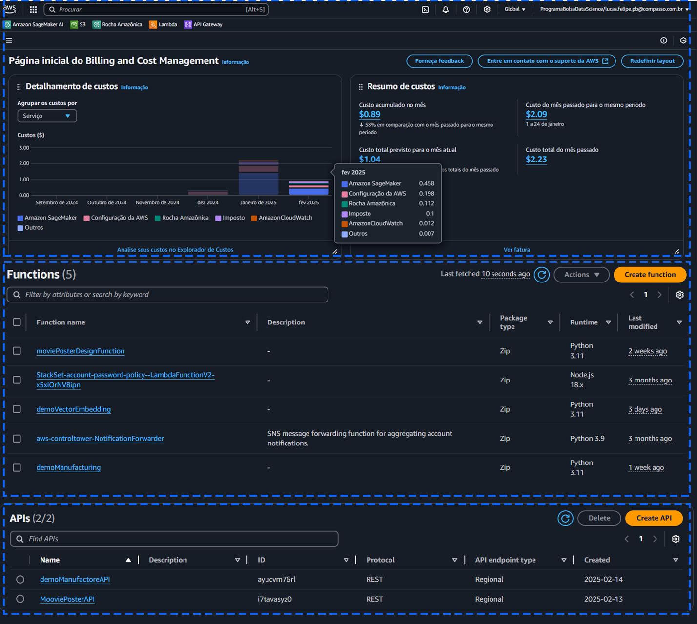

6. Este print mostra o primeiro import do curso de Risco de Crédito. Esta parte está presente no notebook Exercicio2_part1.
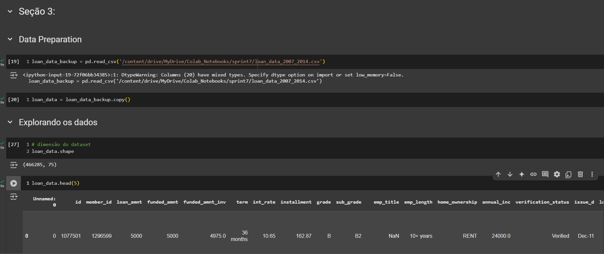

7. Esta imagem mostra a separação dos datasets de treino e teste. Para essa tarefa, é necessário executar todo o notebook uma vez, salvar o DataFrame criado, depois descomentar a célula 69 e executar o DataFrame novamente. Dessa forma, os DataFrames são criados sem serem sobrescritos.
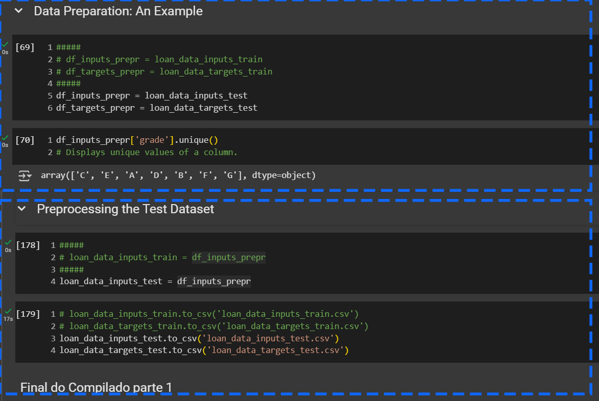

8. Este print mostra os documentos criados anteriormente e em uso a partir da seção 6.
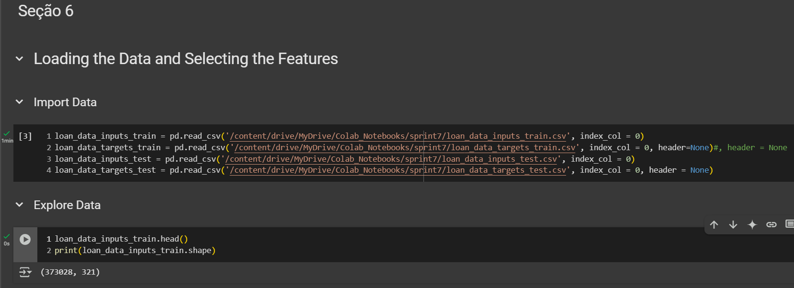

9. O print mostra a execução do fit de um modelo. Este modelo foi uma adaptação de um modelo de regressão logística do scikit-learn, com algumas modificações. Como o código do instrutor apresentava erros devido ao uso de recursos obsoletos, a função precisou ser ajustada. Portanto, o print confirma que a nova função funcionou corretamente.
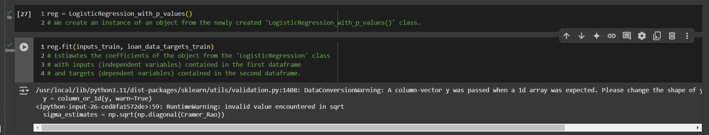

10. Este print mostra a importação do modelo que foi treinado, avaliado e salvo. Após salvar um modelo treinado, ele pode ser utilizado sem a necessidade de um novo treinamento.
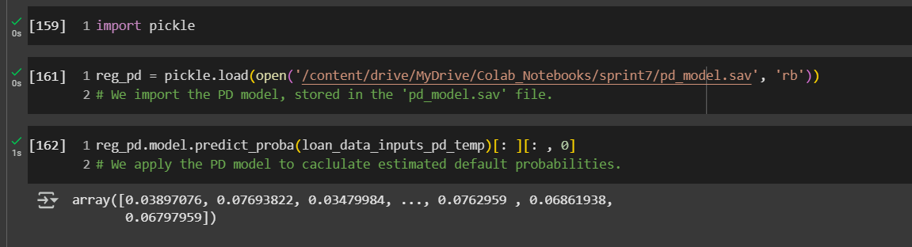

# Certificados

- O curso de Amazon Bedrock proporcionou uma compreensão sólida sobre IA generativa na AWS, abordando desde conceitos básicos até a implementação de aplicações práticas. Foram exploradas ferramentas como Amazon Titan Image Generator v2 para geração de imagens, Claude 3 Haiku para resumo de textos e junto com Langchain e Streamlit para criação de chatbots. Além disso, foi trabalhada a integração com AWS Lambda e API Gateway. O curso ofereceu uma base essencial para aplicar essas tecnologias em projetos reais e facilitar a transição para carreiras na área de inteligência artificial.
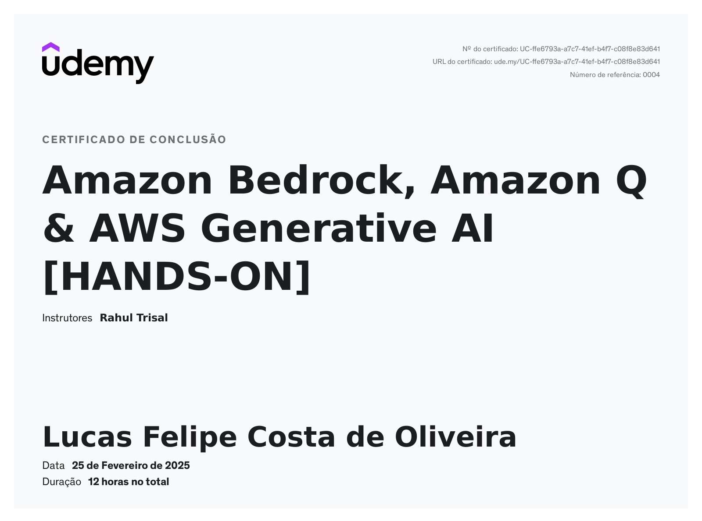

- O curso de Modelagem de Risco de Crédito em Python ensinou como bancos utilizam ciência de dados para avaliar riscos e cumprir regulamentações. Abrangeu a modelagem dos três componentes da perda esperada (PD, LGD e EAD), além da criação de scorecards alinhados às normas de Basileia II e III. Foram exploradas técnicas estatísticas como Regressão Logística, AUC, Gini e Kolmogorov-Smirnov, utilizando dados reais. O curso destacou a importância do pré-processamento e da teoria, proporcionando um aprendizado sólido e prático para aplicação no setor financeiro.
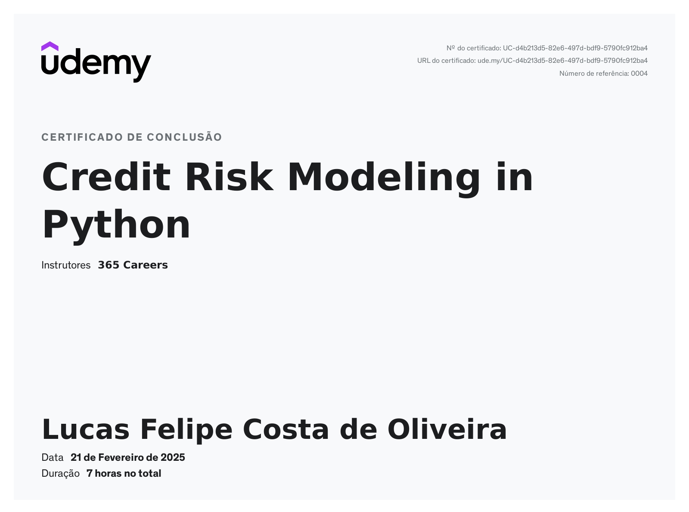

