# Evidências

- Como evidência da preparação, apresento os prints dos seis painéis de pontuação dos simulados em português. 

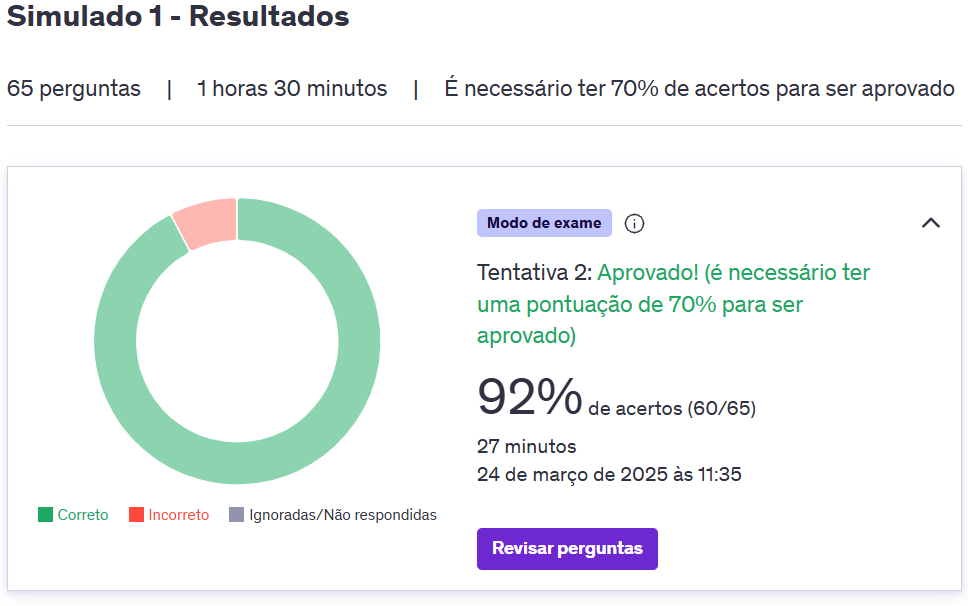
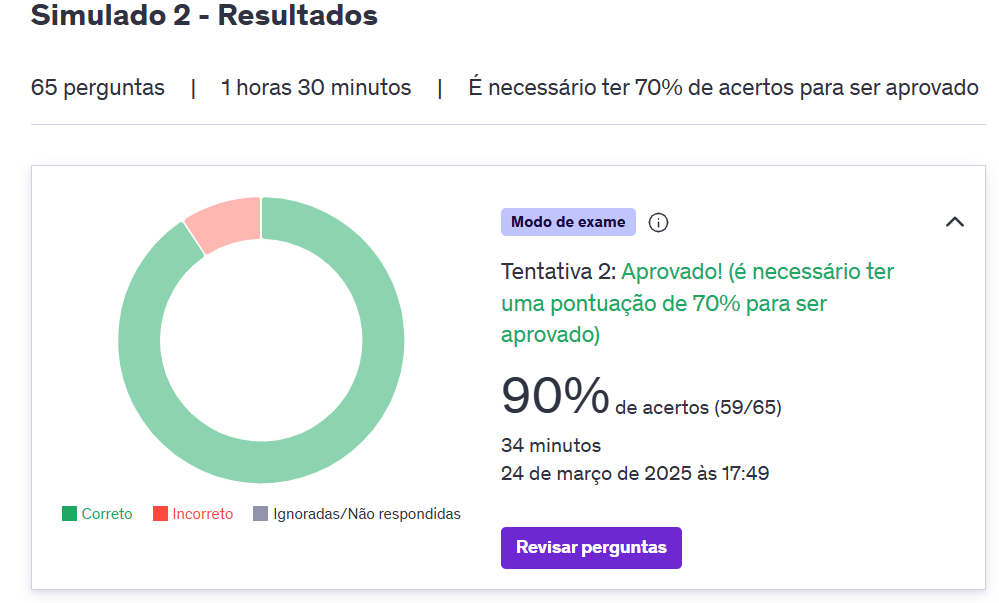
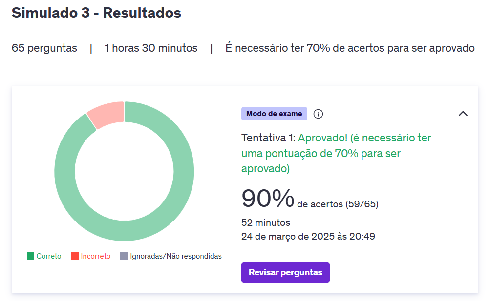
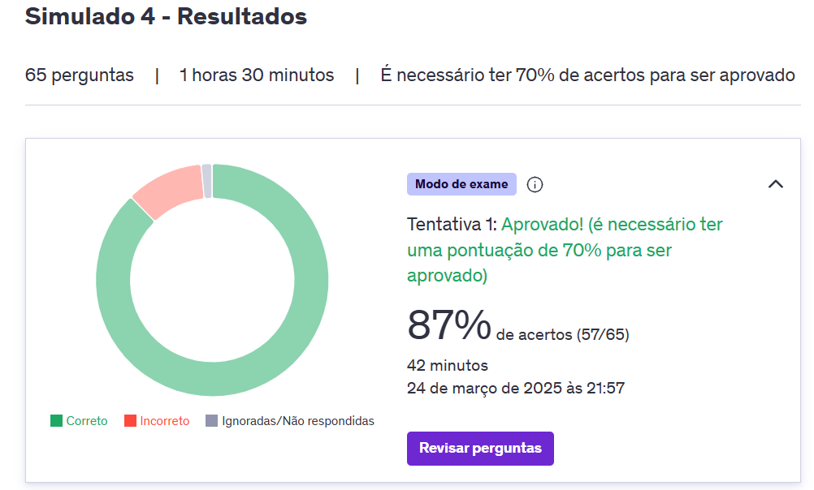
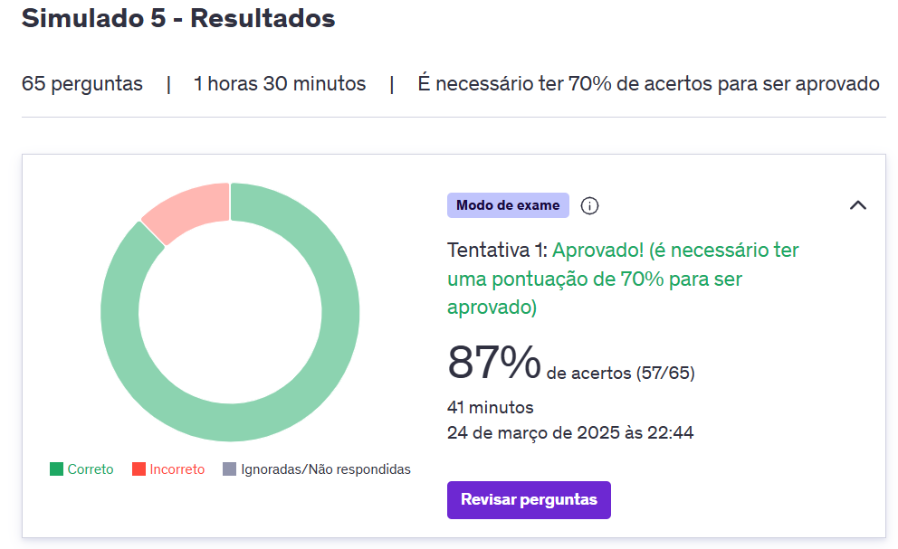
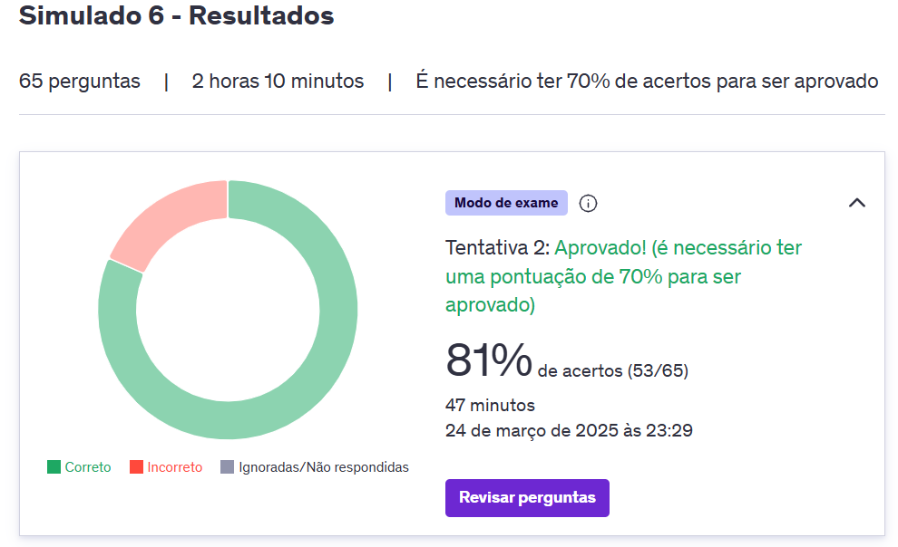
- Simulado aplicado durante reunião técnica da sprint 10.
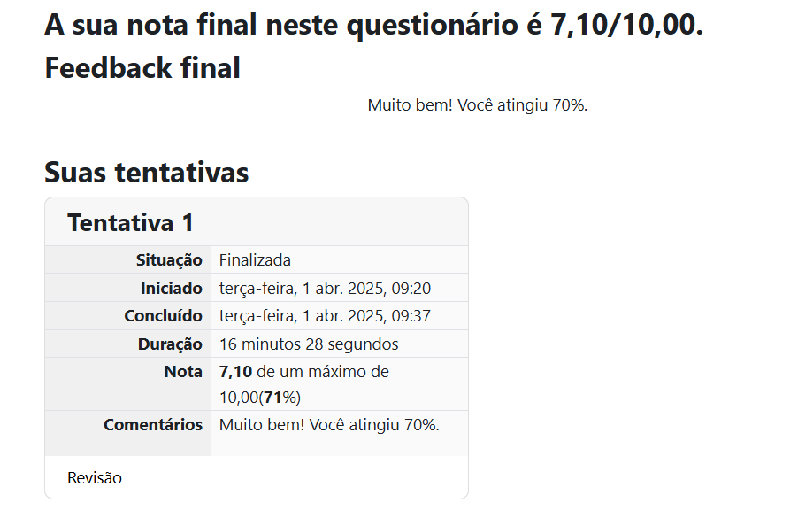

- Print que evidencia a conclusão dos cursos obrigatorios das sprints 9 e 10. 
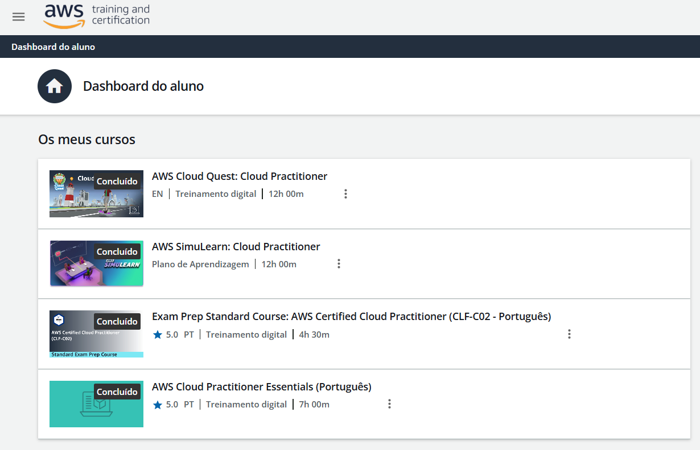

# Certificados

- Certificado do Curso Certified Cloud Practitioner (CLF-C02)
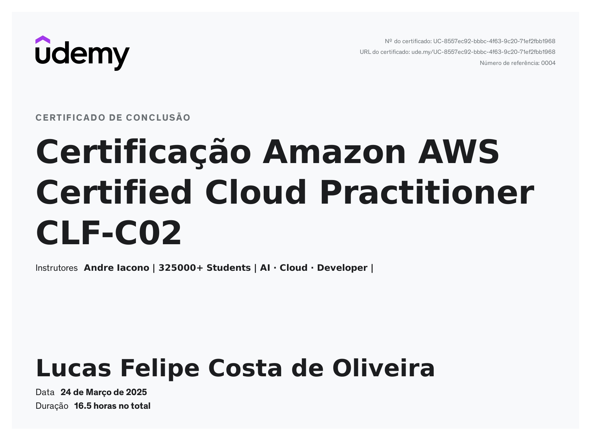

Concluí o curso preparatorio para certificação AWS Certified Cloud Practitioner (CLF-C02), que valida o conhecimento fundamental sobre o ecossistema AWS. Esta certificação reconhecida globalmente abrange os principais conceitos da arquitetura da nuvem, incluindo infraestrutura, segurança, modelos de cobrança e melhores práticas. Essa conquista fortalece minha base em computação em nuvem, permitindo a utilização estratégica da AWS para diferentes necessidades empresariais e tecnológicas.

- Certificado do Curso Certified Cloud Practitioner (CLF-C02)
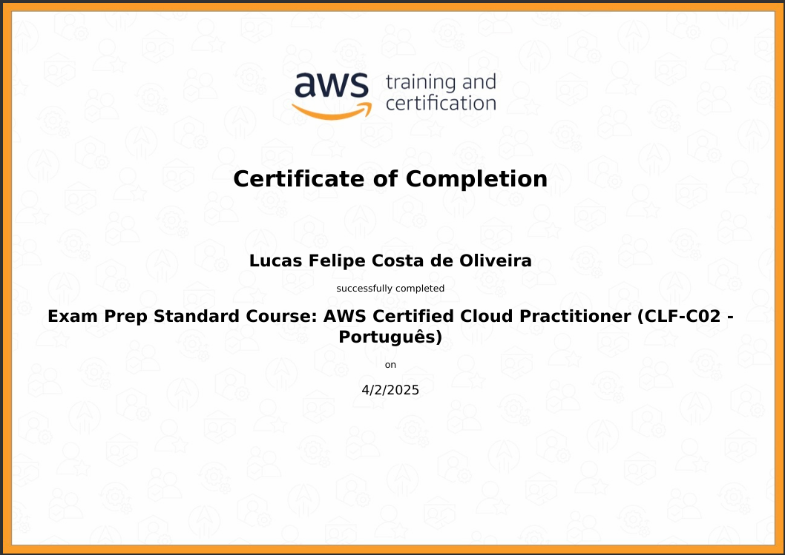
Este 
Neste curso de nível básico da Amazon Web Services (AWS) ajuda preparar para o exame com a análise das áreas de tópico e da relação delas com o desenvolvimento na AWS e com áreas específicas de estudo.

- Certificado do Curso Certified Cloud Practitioner (CLF-C02)
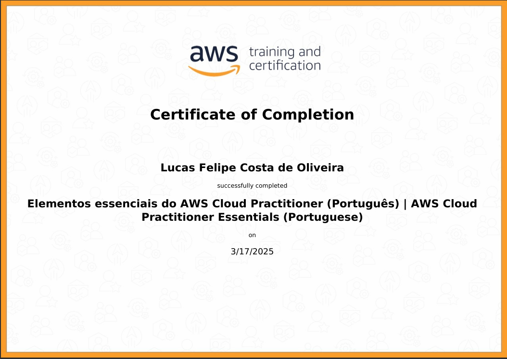

Este curso foi otimo para ter uma visão geral da nuvem AWS. Foram abordados conceitos fundamentais sobre serviços, segurança, arquitetura, preços e suporte da AWS. O conteúdo serviu como base para consolidar o conhecimento em computação em nuvem e auxiliar na preparação para a certificação AWS Cloud Practitioner.